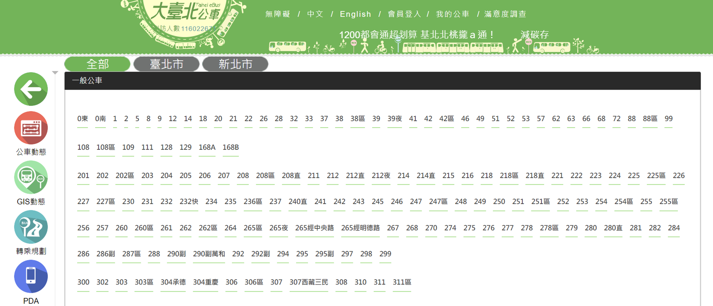
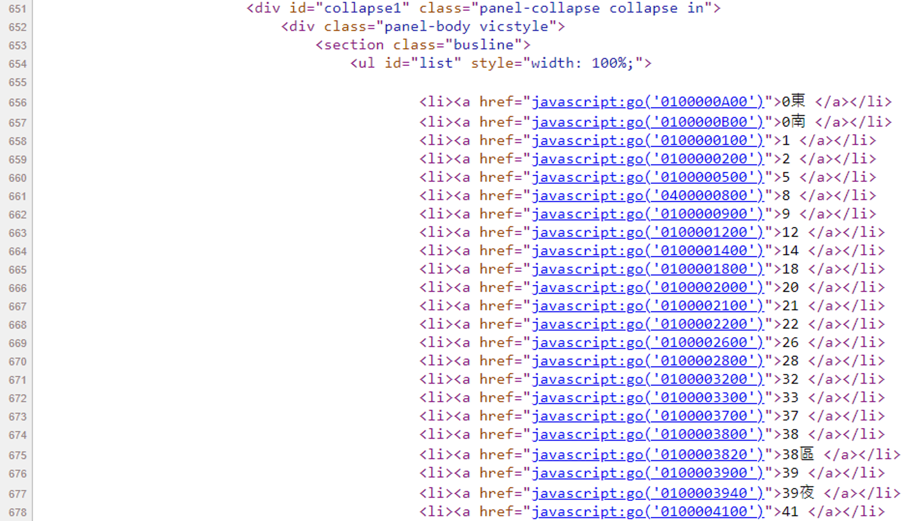

```{r setup6, include=FALSE}
knitr::opts_chunk$set(echo = TRUE)
library(dplyr)
library(sf)
library(ggplot2)
library(ggsflabel)
library(ggspatial)
library(RColorBrewer)
library(knitr)
library(kableExtra)
library(TDX)
library(DT)
library(tmap)
library(rvest)

windowsFonts(A=windowsFont("微軟正黑體"))
tmap_mode("view")

client_id=read.csv("./key.txt", header=F)[1,2]
client_secret=read.csv("./key.txt", header=F)[2,2]
access_token=get_token(client_id, client_secret)
```

# **運輸資料應用**
本章節主要示範運輸資料於實務場域中的應用。


## 計算公車站點間旅行距離
本節透過 TDX 公車站牌與路線圖資，建立演算法計算各站牌的累積里程，進而計算站點間旅行距離[**（簡報）**](https://github.com/ChiaJung-Yeh/TDX_Guide/raw/master/slides/%E8%A8%88%E7%AE%97%E5%85%AC%E8%BB%8A%E7%AB%99%E9%BB%9E%E9%96%93%E6%97%85%E8%A1%8C%E8%B7%9D%E9%9B%A2.pptx)。


### 目的
站點間距離可用以反映任兩站點間公車行駛的實際里程，該數據可進一步與 TDX 歷史資料中的行駛時間（[`Bus_TravelTime()`](#公車站間旅行時間資料)）或公車歷史動態資料（[`Bus_RealTime()`](#公車動態)）對應，以計算各區間的平均速度，尋找公車各時段阻塞的區間，進而提出相對應的改善方式。在 [GTFS](https://gtfs.org/) 格式中，里程資訊為必備欄位，如是可依據各站點的累積里程推算任兩站點間的距離。然而 TDX 的公車站點資料（Bus_StopOfRoute）中並未提供該數據，進而無法計算站點間距離。其一解決方式是將各站點的經緯度輸入至地圖路徑規劃的 API 中，尋找公共運輸的最佳路徑，然而此一方法並不能確保所選擇的運具為特定公車路線；若以私有運具的路徑概似之，其缺點乃公車路線並不確保是最短距離，乃因受限於公車營運之限制或提升服務可及性，站點間距離可能大於兩點間的最短路徑長度。此外，使用地圖 API 曠日廢時或所需費用甚高，因此實務上可能並不合適。綜上所述，本節將建構一套演算法，透過 TDX 既有的公車路線圖資（[`Bus_Shape()`](#公車路線線型資料)）與公車站牌圖資（[`Bus_StopOfRoute()`](#公車站點資料)）切分數個站牌間的區間，依此計算各區間的長度即為站點間旅行距離。由於公車站點並不一定落於公車路線上（通常不可能是），故必須先行地圖匹配（map-matching），本演算法中簡單應用 Paul Newson 與 John Krumm 所提出之[先進地圖匹配法（advanced map-matching）](https://dl.acm.org/doi/pdf/10.1145/1653771.1653818)，將所有公車站牌定位至路線上，以便於拆分並計算累積里程。

### 使用資料與函式
```{r use_function, echo=T, eval=F}
library(TDX)

# TDX 套件中應用函式
Bus_Route()
Bus_Shape()
Bus_StopOfRoute()
```

### 演算概念與步驟
本演算法步驟如圖\@ref(fig:algo-step)所示。圖中綠色點為公車站牌，藍色線段為公車路線，首先將公車站牌匹配至公車路線上，並依此切分公車路線，最後計算兩站牌間的距離即可得站間旅行距離。
```{r algo-step, echo=F, eval=T, out.width="70%", fig.align="center", fig.cap="演算法步驟示意圖"}
# dir_files=dir("./figure/OD_dist", full.names=T)
# gifski::gifski(dir_files, "./figure/OD_dist.gif", width=1412, height=422, delay=1.5)
include_graphics("./figure/OD_dist.gif")
```

請注意此演算法仍會產出部分錯誤的結果，須另行檢查，計算結果的優劣取決於原始 TDX 路線圖資的品質，如雙北市的公車路線圖資出現許多錯誤繞行、數化順序錯誤、SubRouteUID 錯誤對應等情形，導致計算結果錯誤甚大。因此本節以路線品質相對較佳的基隆市市區公車作為範例。


<span style="font-size:15pt;text-decoration:underline">**步驟零：介接公車資料**</span>

透過 TDX 套件介接公車路線、公車站牌、公車路線圖資三份資料。

```{r TDX_data_download, echo=T, eval=F}
access_token=get_token(client_id, client_secret)

#---介接資料---#
# 公車路線資訊
bus_route=Bus_Route(access_token, "Keelung")
# 公車站牌
bus_shape=Bus_Shape(access_token, "Keelung", dtype="sf")%>%
  st_transform(crs=3826)
# 公車路線圖資
bus_stop=Bus_StopOfRoute(access_token, "Keelung", dtype="sf")%>%
  st_transform(crs=3826)

#---以第一條為範例---#
bus_shape_temp=filter(bus_shape, SubRouteUID==bus_route$SubRouteUID[1])
bus_stop_temp=filter(bus_stop, SubRouteUID==bus_route$SubRouteUID[1], Direction==bus_route$Direction[1])

tm_shape(bus_shape_temp)+
  tm_lines()+
  tm_shape(bus_stop_temp)+
  tm_dots()
```

```{r TDX_data_download_output, echo=F, eval=T}
# bus_route=Bus_Route(access_token, "Keelung")
# write.csv(bus_route, "./data/bus_route_keelung.csv", row.names=F)
# bus_shape=Bus_Shape(access_token, "Keelung")
# write.csv(bus_shape, "./data/bus_shape_keelung.csv", row.names=F)
# bus_stop=Bus_StopOfRoute(access_token, "Keelung")
# write.csv(bus_stop, "./data/bus_stop_keelung.csv", row.names=F)

bus_route=read.csv("./data/bus_route_keelung.csv")
bus_shape=read.csv("./data/bus_shape_keelung.csv")%>%
  mutate(geometry=st_as_sfc(geometry))%>%
  st_sf(crs=4326)%>%
  st_transform(crs=3826)
bus_stop=read.csv("./data/bus_stop_keelung.csv")%>%
  mutate(geometry=st_as_sfc(paste0("POINT(", PositionLon, " ", PositionLat, ")")))%>%
  st_sf(crs=4326)%>%
  st_transform(crs=3826)
bus_shape_temp=filter(bus_shape, SubRouteUID==bus_route$SubRouteUID[1])
bus_stop_temp=filter(bus_stop, SubRouteUID==bus_route$SubRouteUID[1], Direction==bus_route$Direction[1])
tm_shape(bus_shape_temp)+
  tm_lines()+
  tm_shape(bus_stop_temp)+
  tm_dots()
```
<br>
由地圖可見，公車站牌大多未落於公車路線上，故本演算法必須先行透過地圖匹配將點位移至路線上！

<br>
<span style="font-size:15pt;text-decoration:underline">**步驟一：拆分公車路線之線段**</span>

依據直線將原始公車圖資切分成數個直線段。先利用`st_coordinate()`將路線所有轉折點全數萃取出。演算法如圖\@ref(fig:algo-step-1)所示。

需注意的是，本演算法的執行係假設路線圖資是依據公車路線由第一站至最後一站方式數化，故部分縣市（如雙北市）公車路線若未依據此一原則數化，則演算法將出現諸多謬誤。

```{r algo-step-1, echo=F, eval=T, out.width="90%", fig.align="center", fig.cap="拆分公車路線示意圖"}
include_graphics("./figure/OD_dist_algo/OD_dist_algo_1.png")
```

```{r algo-step-1-code, echo=T, eval=T}
# 拆分公車路線之線段
bus_shape_coord=data.frame(st_coordinates(bus_shape_temp)[, c(1:2)])%>%
  mutate(geometry=st_as_sfc(paste0("POINT(", X, " ", Y, ")")))%>%
  st_sf(crs=3826)
dist_point=as.numeric(st_distance(bus_shape_coord[1:(nrow(bus_shape_coord)-1),],
                                  bus_shape_coord[2:(nrow(bus_shape_coord)),], by_element=T))

tm_shape(bus_shape_temp)+
  tm_lines()+
  tm_shape(bus_stop_temp)+
  tm_dots()+
  tm_shape(bus_shape_coord)+
  tm_dots(col="blue")
```


<br>
<span style="font-size:15pt;text-decoration:underline">**步驟二：將各路段細分**</span>

由於直線段可能很長，致使後續點為匹配過於粗糙，並非最接近的點位，故須將步驟一切分完成的路段再細分為至多每 10 公尺之路段，確保精確匹配。

```{r algo-step-2, echo=F, eval=T, out.width="90%", fig.align="center", fig.cap="公車路段細分示意圖"}
include_graphics("./figure/OD_dist_algo/OD_dist_algo_2.png")
```

```{r algo-step-2-code, echo=T, eval=T}
# 將各路段細分為至多每10公尺一段(使配對更為精確)
all_point=data.frame()
for(i in c(1:nrow(bus_shape_coord))){
  if(i!=nrow(bus_shape_coord)){
    new_int_num=ceiling(dist_point[i]/10)
    if(new_int_num>1){
      new_point=data.frame(X=mapply(function(x) bus_shape_coord$X[i]+((bus_shape_coord$X[i+1]-bus_shape_coord$X[i])/new_int_num)*x, c(1:(new_int_num-1))),
                           Y=mapply(function(x) bus_shape_coord$Y[i]+((bus_shape_coord$Y[i+1]-bus_shape_coord$Y[i])/new_int_num)*x, c(1:(new_int_num-1))))
      temp_point=rbind(data.frame(X=bus_shape_coord$X[i], Y=bus_shape_coord$Y[i]), new_point)
      all_point=rbind(all_point, temp_point)
    }else{
      all_point=rbind(all_point, data.frame(X=bus_shape_coord$X[i], Y=bus_shape_coord$Y[i]))
    }
  }else{
    all_point=rbind(all_point, data.frame(X=bus_shape_coord$X[i], Y=bus_shape_coord$Y[i]))
  }
}
all_point=mutate(all_point, geometry=st_as_sfc(paste0("POINT(", X, " ", Y, ")")))%>%
  st_sf(crs=3826)

tm_shape(bus_shape_temp)+
  tm_lines()+
  tm_shape(bus_stop_temp)+
  tm_dots()+
  tm_shape(all_point)+
  tm_dots(col="blue")
```


<br>
<span style="font-size:15pt;text-decoration:underline">**步驟三：計算各路線切分點之間的距離與累積里程**</span>

將所有路線的點萃取完成後，即可計算每一個點的累積里程。事實上 GTFS 資料即是透過這樣的方式建立資料，故若未來 TDX 可提供「符合國際公定標準」的公共運輸資料格式，則本演算法無須如此複雜。

```{r algo-step-3, echo=F, eval=T, out.width="90%", fig.align="center", fig.cap="累積里程計算示意圖"}
include_graphics("./figure/OD_dist_algo/OD_dist_algo_3.png")
```

```{r algo-step-3-code, echo=T, eval=T}
# 計算各點之間的距離與累積里程
dist_point=as.numeric(st_distance(all_point[1:(nrow(all_point)-1),], all_point[2:(nrow(all_point)),], by_element=T))
all_point$Dist_Cum=c(0, mapply(function(x) sum(dist_point[1:x]), c(1:length(dist_point))))

head(all_point)
```


<br>
<span style="font-size:15pt;text-decoration:underline">**步驟四：計算原始公車站牌與路線切分點間的距離關係**</span>

計算原始公車站牌與路線切分點兩圖資間各點的距離，並挑選可匹配的候選點。為避免擷取過多資料運算，在此僅挑選鄰近站牌 30 公尺以內作為候選點。

```{r algo-step-4, echo=F, eval=T, out.width="90%", fig.align="center", fig.cap="計算站牌與切分點間之距離示意圖"}
include_graphics("./figure/OD_dist_algo/OD_dist_algo_4.png")
```

```{r algo-step-4-code, echo=T, eval=T}
# 計算站點與候選點間距離並給定標籤(只篩選小於30公尺者)
min_ret=function(x, y){
  Dist=x[x<30]
  Seq=which(x<30)

  if(length(Dist)==0){
    Dist=min(x)
    Seq=which.min(x)
  }
  return(list(Dist=Dist, Seq=Seq))
}

# 計算各點之間的距離與累積里程
all_dist=as.matrix(st_distance(bus_stop_temp, all_point))
all_dist_poss=apply(all_dist, 1, min_ret)

# 查看第一個站牌的距離與配對的候選點
all_dist_poss[[1]]
```

由以上回傳資料可知，第一個站牌鄰近 30 公尺內的候選點共 5 個，為切分點資料的第 1、2、3、4、1538 筆資料（`$Seq`之標籤），而其距離存於`$Dist`之標籤中。


<br>
<span style="font-size:15pt;text-decoration:underline">**步驟五：演算法尋找最可能匹配點位**</span>

此一步驟為本演算法的核心，係利用 Hidden Markov Model 之地圖匹配法，此一演算法大量應用於 GPS 或信令資料的地圖匹配程序中。其中機率分為 emission probability 與 transition probability。前者為打點位置與候選點間匹配的機率，若兩者直線距離愈大，機率愈低，於本案例中即是公車站牌至鄰近公車路線上候選點間的距離，若距離愈大機率即愈低。後者則為打點位置所匹配之候選點轉移至下一個候選點的機率，通常是兩者的距離愈短，機率愈高。Hidden Markov Model 照理而言是動態的模型，前一次的決定會影響後者，故演算法甚為複雜。而由於本案例中公車站牌數化的飄移位置並不大，且其所對應的公車路線亦已存在出現次序，故可單純利用貪婪（myopic）的方式，將每一公車站牌當下的 emission probability 與 transition probability 相乘取最大之機率值作為最終候選點即可。

```{r algo-step-5, echo=F, eval=T, out.width="90%", fig.align="center", fig.cap="尋找最可能匹配點位示意圖"}
include_graphics("./figure/OD_dist_algo/OD_dist_algo_5.png")
```

```{r algo-step-5-code, echo=T, eval=T}
# 演算法尋找最可能匹配點位(類似Hidden Markov Model)
all_seq=c()
step_seq=0
for(m in c(1:length(all_dist_poss))){
  emis_prob=abs(1/all_dist_poss[[m]]$Dist)
  trans_prob=1/(all_dist_poss[[m]]$Seq-step_seq)
  step_seq=all_dist_poss[[m]]$Seq[which.max(emis_prob*trans_prob)]
  all_seq=c(all_seq, step_seq)
}
print(all_seq)
```

此一順序即是對照公車路線切分點的資料，如第一個公車站牌所對應的數值為 1，意指該公車站牌應匹配至切分點的第 1 筆資料；又如第二個公車站牌所對應的數值為 23，意指該公車站牌應匹配至切分點的第 23 筆資料，以此類推。

<br>
<span style="font-size:15pt;text-decoration:underline">**步驟六：將匹配點位貼附於原始公車資料中**</span>

最後把前一步驟結果的候選點合併至原始的公車站牌中，並透過累積里程計算兩站點間旅行距離。

```{r algo-step-6-code-1, echo=T, eval=T}
# 將匹配點位貼附於原始公車資料中
bus_stop_temp_rev=cbind(st_drop_geometry(bus_stop_temp), all_point[all_seq,])%>%
  st_sf(crs=3826)

# 透過累積里程計算兩站點間距離
bus_stop_temp_rev$Dist_Intv=c(NA, bus_stop_temp_rev$Dist_Cum[c(2:nrow(bus_stop_temp_rev))]-bus_stop_temp_rev$Dist_Cum[c(1:nrow(bus_stop_temp_rev)-1)])

tm_shape(bus_shape_temp)+
  tm_lines()+
  tm_shape(bus_stop_temp)+
  tm_dots()+
  tm_shape(bus_stop_temp_rev)+
  tm_dots(col="red")
```

地圖中紅色點表示最終匹配的點位，所有點位必定落於公車路線上。最終結果匯出如下表所示。其中`Dist_Cum`是站點累積里程，`Dist_Intv`是該站與前一站之間的路網距離。如以下資料中，第一個公車站牌為「深美國小(消防分隊)」，累積里程為0；第二個公車站牌為「深美街」，累積里程為 206 公尺，故第一個公車站牌與第二個公車站牌間的旅行距離為 206 公尺。

```{r algo-step-6-code-2, echo=F, eval=T}
datatable(st_drop_geometry(bus_stop_temp_rev), options=list(pageLength=5, scrollX=T, headerCallback = DT::JS(
    "function(thead) {",
    "  $(thead).css('font-size', '0.7em');",
    "}"
  )))%>%
  formatStyle(columns=c(1:ncol(bus_stop_temp_rev)), fontSize='80%')%>%
  formatRound(c("PositionLon", "PositionLat"), digits=4)%>%
  formatRound(c("X", "Y"), digits=2)%>%
  formatRound(c("Dist_Cum", "Dist_Intv"), digits=0)
```


完整程式碼請參見[此](https://raw.githubusercontent.com/ChiaJung-Yeh/TDX_Guide/master/code/%E5%85%AC%E8%BB%8A%E7%AB%99%E9%96%93%E8%B7%9D%E9%9B%A2%E8%A8%88%E7%AE%97.R)。


## 電子票證資料分析
本節透過 TDX 函式介接 YouBike 場站資料與臺北市公共自行車電子票證資料，並分析起訖對（OD Pair）流量與繪製地圖。

### 目的
電子票證資料係具有極高價值的資料，可細部瞭解民眾搭乘公共運輸的行為，諸如起訖對分布、轉乘行為、使用者類型等，以探勘既有公共運輸系統下民眾的旅運分布，並針對未來公共運輸發展提出具體政策建議。惟須注意的是，目前電子票證資料僅臺北市公共自行車為公開介接，可清楚每一使用者騎乘的租還時間與站點，其他縣市或運具的電子票證資料皆為「非公開資料」，必須撰寫計畫書向交通部數據匯流平臺申請([詳見此](#常見運輸資料平臺))。是故，本節利用公開的臺北市公共自行車電子票證資料作為示範分析。

### 使用資料與函式
```{r use_function_smartcard, echo=T, eval=F, warning=F, message=F}
library(TDX)

# TDX 套件中應用函式
Bike_Station()
Bike_OD_His()
```

```{r TDX_data_download_smartcard, echo=T, eval=F, warning=F, message=F}
access_token=get_token(client_id, client_secret)

#---介接資料---#
# 臺北市公共自行車站點資料(介接2023年5月31日的資料)
bike_station=Bike_Station(access_token, "Taipei", dates="2023-05-31", dtype="sf")

# 臺北市公共自行車電子票證資料
bike_od_his=Bike_OD_His(bikesys=2, time="2023-05")

# 站點分布地圖
tm_shape(bike_station)+
  tm_dots()
```

```{r TDX_data_download_smartcard_exe, echo=F, eval=T, warning=F, message=F}
# bike_station=Bike_Station(access_token, "Taipei", dates="2023-05-31", out="./data/bike_station_taipei.csv")
# bike_od_his=Bike_OD_His(bikesys=2, time="2023-05", "C:/Users/USER/OneDrive - The University of Sydney (Students)/Desktop/R Transportation/R Github Project/Data_Out/bike_od_his_taipei.csv")

bike_station=read.csv("./data/bike_station_taipei.csv")%>%
  mutate(geometry=st_as_sfc(paste0("POINT(", PositionLon, " ", PositionLat, ")")))%>%
  st_sf(crs=4326)%>%
  st_transform(crs=3826)
bike_od_his=data.table::fread("C:/Users/USER/OneDrive - The University of Sydney (Students)/Desktop/R Transportation/R Github Project/Data_Out/bike_od_his_taipei.csv")

tm_shape(bike_station)+
  tm_dots()
```
<br>
由地圖先行觀察臺北市 YouBike 站點分布，可發現 YouBike 2.0 的密度非常高，截至 2023 年 5 月 31 日止，共計 1281 個站點。

### 分析電子票證資料
<br>
<span style="font-size:15pt;text-decoration:underline">**整理電子票證**</span>
```{r TDX_data_clean_smartcard, echo=T, eval=F, warning=F, message=F}
#---處理時間格式---#

# 將時間格式轉換為臺北標準時間
library(lubridate) # 引入處理時間的套件
bike_od_his$RentTime=as_datetime(bike_od_his$RentTime, tz="Asia/Taipei")
bike_od_his$ReturnTime=as_datetime(bike_od_his$ReturnTime, tz="Asia/Taipei")

# 建立計算時間的函式(將「時:分:秒」轉換為分鐘數)
time_conv=function(x){
  time_hr=as.numeric(substr(x, 1, regexpr(":", x)-1)) # 小時數
  time_min=as.numeric(substr(x, regexpr(":", x)+1, regexpr(":", x)+2)) # 分鐘數
  time_sec=as.numeric(substr(x, regexpr(":", x)+4, regexpr(":", x)+5)) # 秒數
  return((time_hr*60+time_min+time_sec/60))
}

# 計算騎乘時間(分鐘)
bike_od_his$RideTime=time_conv(bike_od_his$RideTime)
```

```{r TDX_data_clean_smartcard_exe, echo=F, eval=T, warning=F, message=F}
library(lubridate)
bike_od_his$RentTime=force_tz(bike_od_his$RentTime, tz="Asia/Taipei")
bike_od_his$ReturnTime=force_tz(bike_od_his$ReturnTime, tz="Asia/Taipei")
time_conv=function(x){
  time_hr=as.numeric(substr(x, 1, regexpr(":", x)-1)) # 小時數
  time_min=as.numeric(substr(x, regexpr(":", x)+1, regexpr(":", x)+2)) # 分鐘數
  time_sec=as.numeric(substr(x, regexpr(":", x)+4, regexpr(":", x)+5)) # 秒數
  return((time_hr*60+time_min+time_sec/60))
}
bike_od_his$RideTime=time_conv(bike_od_his$RideTime)
```

程式碼中`lubridate`為 R 語言中處理時間的套件，利用 `as_datetime()`函式將租借與還車時間欄位（`RentTime`與`ReturnTime`）的文字資料轉換為時間格式。此外，以上程式碼中建立計算時間的函式（`time_conv()`），將原本騎乘時間欄位（`RideTime`）轉換為分鐘數，以便後續計算與分析。該函式中的[`substr()`](https://statisticsglobe.com/r-substr-substring)係用以截取自串中的第 X 個字元到第 Y 個字元；[`regexpr()`](https://cran.r-project.org/web/packages/stringr/vignettes/regular-expressions.html)係用以檢查特定文字位於字串中的第幾個字元。

<br>
<span style="font-size:15pt;text-decoration:underline">**統計騎乘時間分布**</span>

接著針對騎乘時間分布計算統計值，常見指標如平均值（`mean()`）、中位數（`median()`）、全距（`range()`）、標準差（`sd()`）、最大值（`max()`）、最小值（`min()`）、敘述性統計（`summary()`），並繪製騎乘時間四分位數圖如圖\@ref(fig:TDX-data-statistics-smartcard-exe2)所示，及騎乘時間密度圖如圖\@ref(fig:TDX-data-statistics-smartcard-exe3)所示。

```{r TDX_data_statistics_smartcard, echo=T, eval=F, warning=F, message=F}
#---計算騎乘時間統計值(Descriptive Statistics)---#
# 平均值
mean(bike_od_his$RideTime)
# 中位數
median(bike_od_his$RideTime)
# 全距
range(bike_od_his$RideTime)
# 標準差
sd(bike_od_his$RideTime)
# 最大值
max(bike_od_his$RideTime)
# 最小值
min(bike_od_his$RideTime)
# 利用summary函式查看主要統計指標
summary(bike_od_his$RideTime)

#---刪除離群值---#
# 計算四分位距(Interquartile range)
IQR=quantile(bike_od_his$RideTime, 0.75)-quantile(bike_od_his$RideTime, 0.25)
# Q3+1.5*IQR以上者，定義為離群值
outlier=as.numeric(quantile(bike_od_his$RideTime, 0.75)+1.5*IQR)
# 計算離群值個數
sum(bike_od_his$RideTime>quantile(bike_od_his$RideTime, 0.75)+1.5*IQR)
# 刪除離群值
bike_od_his=bike_od_his[which(bike_od_his$RideTime<outlier)]

# 畫騎乘時間四分位數圖
ggplot()+
  geom_boxplot(aes(y=bike_od_his$RideTime))

# 畫騎乘時間密度圖
ggplot()+
  geom_density(aes(x=bike_od_his$RideTime))
```

```{r TDX_data_statistics_smartcard_exe1, echo=F, eval=T, warning=F, message=F}
cat(paste0("平均值： ", round(mean(bike_od_his$RideTime), 3)))
cat(paste0("全距： ", round(median(bike_od_his$RideTime), 3)))
cat(paste0("標準差： ", round(sd(bike_od_his$RideTime), 3)))
cat(paste0("最大值： ", round(max(bike_od_his$RideTime), 3)))
cat(paste0("最小值： ", round(min(bike_od_his$RideTime), 3)))
cat(paste0("主要統計指標：\n"))
summary(bike_od_his$RideTime)

IQR=quantile(bike_od_his$RideTime, 0.75)-quantile(bike_od_his$RideTime, 0.25)
outlier=as.numeric(quantile(bike_od_his$RideTime, 0.75)+1.5*IQR)
cat(paste0("離群值個數： ", sum(bike_od_his$RideTime>quantile(bike_od_his$RideTime, 0.75)+1.5*IQR)))

bike_od_his=bike_od_his[which(bike_od_his$RideTime<outlier)]
```

```{r TDX-data-statistics-smartcard-exe2, echo=F, eval=T, out.width="80%", fig.align="center", fig.cap="騎乘時間四分位數圖", warning=F, message=F}
ggplot()+
  geom_boxplot(aes(y=bike_od_his$RideTime))+
  ylab("騎乘時間")+
  theme_minimal()+
  theme(axis.title.x=element_blank(),
        axis.text.x=element_blank(),
        axis.title.y=element_text(family="A", size=15),
        axis.text.y=element_text(family="A", size=12))
```

```{r TDX-data-statistics-smartcard-exe3, echo=F, eval=T, out.width="80%", fig.align="center", fig.cap="騎乘時間密度圖", warning=F, message=F}
ggplot()+
  geom_density(aes(x=bike_od_his$RideTime))+
  xlab("騎乘時間")+ ylab("密度")+
  theme_minimal()+
  theme(axis.title=element_text(family="A", size=15),
        axis.text=element_text(family="A", size=12))
```

<br>
<span style="font-size:15pt;text-decoration:underline">**統計站點起訖對**</span>

統計各站點起訖對於擷取資料一個月內的所有流量，進而瞭解其空間分布情形。利用 `dplyr()`套件中的 [`group_by %>% summarise()`](https://chiajung-yeh.github.io/R-Code-Sharing/R_Preliminary/R_Preliminary.html#24_Group_by_(_Summarise)) 函式，針對起站（）與訖站先行分群，並將相同起訖對者計算出現次數（`n()`），即為該起訖對於特定月份的旅次總量。此外利用 [`arrange()`](https://chiajung-yeh.github.io/R-Code-Sharing/R_Preliminary/R_Preliminary.html#26_Arrange) 函式將計算結果由多至少排列。

```{r TDX_data_od_smartcard, echo=T, eval=F, warning=F, message=F}
#---統計站點起訖對流量---#
# 統計完成後依據旅次量由多至少排列
bike_od_trip=group_by(bike_od_his, RentStation, ReturnStation)%>%
  summarise(Trips=n())%>%
  arrange(desc(Trips))

# 擷取前二十大起訖對
bike_od_trip[1:20,]
```

計算結果如下表所示。由表中可見，往返於「臺灣科技大學側門」與「捷運公館站(2號出口)」間的起訖對為全臺北市旅次量最大者。

```{r TDX_data_od_smartcard_exe, echo=F, eval=T, warning=F, message=F}
bike_od_trip=group_by(bike_od_his, RentStation, ReturnStation)%>%
  summarise(Trips=n())%>%
  arrange(desc(Trips))
datatable(bike_od_trip[1:20,], options=list(pageLength=5, scrollX=T, headerCallback = DT::JS(
    "function(thead) {",
    "  $(thead).css('font-size', '0.7em');",
    "}"
  )))%>%
  formatStyle(columns=c(1:ncol(bike_od_trip)), fontSize='80%')
```


## 大臺北公車資訊爬蟲
TDX 提供相當優渥的公共運輸資料，然而部分資料存在瑕疵，使分析或應用上相當困難。臺北市公車路線資料中，同一路線通常含有數條公車子路線，卻無法一一對應於線型資料（shape），且該資料中的子路線代碼部分為空白。此外線型資料不分去返程方向，故在使用時需格外注意，以避免分析謬誤。舉例而言，臺北公車「508」路線，其路線資訊與幾何線型分別如表\@ref(tab:taipei-bus-eg1)與表\@ref(tab:taipei-bus-eg2)所示。由表\@ref(tab:taipei-bus-eg1)可知，508 公車路線共計兩條，其一為去程（Direction:0），另一為返程（Direction:1）。由表\@ref(tab:taipei-bus-eg2)可知，路線線型幾何僅一筆資料，其幾何型態為`MULTILINESTRING`，含括多個線段。由此可見，無法將每一路線對應至唯一的幾何線型。另參見下方地圖，可發現 508 公車的`MULTILINESTRING`在一條道路中最多上達 4 條平行的路徑（放大地圖觀察！），並不合理，顯見 TDX 平臺所提供的路徑有些許瑕疵。

[大臺北公車](https://ebus.gov.taipei/ebus)網站為一公車資訊查詢平臺，使用者可查詢每一條公車的去返程路線，並於地圖上顯示公車路線的站牌與線形。此一平臺的公車路線具方向性，此意味著該平臺後臺的路線幾何資訊應與 TDX 不相同，且其所使用的資訊更為精確。該平臺的[508路線](https://ebus.gov.taipei/Route/StopsOfRoute?routeid=0100050800)如圖\@ref(fig:TaipeiBus508)所示，由網頁介面可發現，路線去返程的線型係分開顯示，且無重疊的路線。

```{r taipei-bus-eg1, echo=F, eval=T}
# bus_shape=Bus_Shape(access_token, "Taipei", dtype="sf", out="C:/Users/USER/OneDrive - The University of Sydney (Students)/Desktop/R Transportation/R Github Project/Data_Out/taipei_shape.shp")
# bus_route=Bus_Route(access_token, "Taipei", out="C:/Users/USER/OneDrive - The University of Sydney (Students)/Desktop/R Transportation/R Github Project/Data_Out/taipei_route.csv")
bus_shape=read_sf("C:/Users/USER/OneDrive - The University of Sydney (Students)/Desktop/R Transportation/R Github Project/Data_Out/taipei_shape.shp")
colnames(bus_shape)=c("RouteUID","RouteID","RouteName","SubRouteUID","SubRouteID","SubRouteName","geometry")
bus_route=read.csv("C:/Users/USER/OneDrive - The University of Sydney (Students)/Desktop/R Transportation/R Github Project/Data_Out/taipei_route.csv", encoding="UTF-8")

kable(filter(bus_route, RouteName %in% c("508"))[, c("RouteUID","RouteName","SubRouteUID","SubRouteName","Direction")], booktabs=T, caption="508 公車路線資訊")%>%
  kable_styling(bootstrap_options=c("striped", "hover"), font_size=14)%>%
  row_spec(0, bold=T, color="white", background="#8E8E8E")
```

```{r taipei-bus-eg2, echo=F, eval=T}
kable(filter(bus_shape, RouteName %in% c("508"))[, c("RouteUID","RouteName","SubRouteUID","SubRouteName","geometry")], booktabs=T, caption="508 公車路線幾何")%>%
  kable_styling(bootstrap_options=c("striped", "hover"), font_size=14)%>%
  row_spec(0, bold=T, color="white", background="#8E8E8E")

tm_shape(filter(bus_shape, RouteName %in% c("508")))+
  tm_lines(col="blue")
```

<br>

```{r TaipeiBus508, echo=F, out.width="100%", fig.align="center", fig.cap="大臺北公車平臺之508公車路線"}
include_graphics("./figure/Taipei Bus/Taipei Bus 508.png")
```


有鑑於此，本節將透過爬蟲擷取[大臺北公車](https://ebus.gov.taipei/ebus)的資訊。於 R 語言中，爬蟲所需使用的套件為`rvest`，內含多個函式可讀取與分析 html 檔案，並萃取所需資訊。


<span style="font-size:15pt;text-decoration:underline">**步驟一：擷取所有路線表**</span>

參見[大臺北公車網頁公車動態介面](https://ebus.gov.taipei/ebus)如圖\@ref(fig:TaipeiBusPlatform)所示，其中羅列所有雙北市的公車路線名稱，必須先將所有路線彙整於一張表，以便後續分析與查詢。

```{r TaipeiBusPlatform, echo=F, out.width="100%", fig.align="center", fig.cap="大臺北公車平臺介面"}

```


```{r TaipeiBus-code1, echo=T, eval=F}
# 擷取所有路線表
url="https://ebus.gov.taipei/ebus"
html_content=read_html(url)

# 擷取標籤(方法一)
all_route=html_nodes(html_content, "div section ul li a")

# 擷取標籤(方法二)
all_route=html_nodes(html_content, "#list a")

# 萃取資訊
all_route=data.frame(UniRouteId=gsub("javascript:go\\(|\\)|'", "", html_attr(all_route, 'href')),
                     UniRouteName=gsub(" ", "", html_text(all_route)))
```


程式碼中首先藉由`read_html()`函式讀取指定網頁（url）的 html 檔案，接著萃取節點資訊。`"div section ul li a"`與`"#list a"`皆為圖\@ref(fig:TaipeiBusPlatform)中所有路線名稱的 html 標籤，可以透過兩種方式尋找之：

* 方法一：
  1. 於網頁任意處點選滑鼠右鍵，並點選「檢視網頁原始碼」（或 Ctrl+U）
  2. 尋找到公車路線名稱的標籤，如圖\@ref(fig:html-node)所示
  3. 依據層級設定標籤（如`"div section ul li a"`）


```{r html-node, echo=F, out.width="100%", fig.align="center", fig.cap="html 網頁標籤"}

```

* 方法二：
  1. 下載 [chrome SelectorGadget](https://chrome.google.com/webstore/detail/selectorgadget/mhjhnkcfbdhnjickkkdbjoemdmbfginb)
  2. 在 chrome 網頁的擴充功能（通常位於畫面右上角）中點選 SelectorGadget
  3. 挑選所需要元素（黃框），並移除不需要的元素（紅框），待畫面黃色框選處皆為需要的元素後即可複製當下所顯示的 html 標籤（參見以下影片）

<p align="center"><iframe width="600" height="338" src="https://www.youtube.com/embed/fAI55Kl2QPo" title="SelectorGadget 操作說明" frameborder="0" allow="accelerometer; autoplay; clipboard-write; encrypted-media; gyroscope; picture-in-picture; web-share" allowfullscreen></iframe></p>


`html_nodes()`函式中第一個引數放置讀取的 html 檔案（html_content），第二個引數則放置前文所尋得的節點，如是即可萃取所有該節點內的公車路線資訊，此時所得資訊如下：

```{r TaipeiBus-code1-output, echo=F, eval=T}
html_content=read_html("https://ebus.gov.taipei/ebus")
all_route=html_nodes(html_content, "div section ul li a")
print(all_route)
```

由於路線名稱為每一個標籤的結果，故可直接透過`html_text()`函式萃取路線名稱。路線代碼則位於 href 的屬性中（`javascript:go('XXXXXXXXXX')`），故透過`html_attr()`函式萃取連結屬性。程式碼中的`gsub()`函式係用以去除不重要的字元，以取得完整的路線代碼與名稱。


<span style="font-size:15pt;text-decoration:underline">**步驟二：逐一擷取路線與站點**</span>

依據雷同的爬蟲方式，務必觀察網頁原始碼，取得網頁的節點資訊，並從中萃取站點與路線相關資訊，程式碼撰寫如下。

```{r TaipeiBus-code2, echo=T, eval=F}
# 逐一擷取路線與站點
bus_route_all=data.frame()
bus_stop_all=data.frame()
bus_shape_all=data.frame()

for(i in c(1:length(all_route$UniRouteId))){
  url=paste0("https://ebus.gov.taipei/Route/StopsOfRoute?routeid=", all_route$UniRouteId[i])
  html_content=read_html(url)
  html_content=html_nodes(html_content, "script")
  html_content=html_content[grepl("routeJsonString", html_content)]
  html_content=strsplit(as.character(html_content), "\n")[[1]]
  html_content=html_content[grepl("routeJsonString", html_content)]
  html_content=strsplit(as.character(html_content), ";\\r")[[1]]
  html_content=as.character(html_content[grepl("stringify", html_content)])
  html_content=substr(html_content, regexpr("stringify", html_content)+10, max(which(strsplit(html_content, "")[[1]]=="}")))
  html_content=rjson::fromJSON(html_content)

  # Bus Route
  bus_route=data.frame(html_content[c("UniRouteId","Name","BeginStop","LastStop","TicketPrice","BusTimeDesc","HeadwayDesc","HolidayBusTimeDesc","HolidayHeadwayDesc","SegmentBuffer","orgphone")])%>%
    rename(UniRouteName=Name)

  # Bus Stop
  temp1=data.frame(UniRouteId=bus_route$UniRouteId,
                   UniRouteName=bus_route$UniRouteName,
                   UniStopId=mapply(function(x) html_content$GoDirStops[[x]]$UniStopId, c(1:length(html_content$GoDirStops))),
                   UniStopName=mapply(function(x) html_content$GoDirStops[[x]]$Name, c(1:length(html_content$GoDirStops))),
                   Longitude=mapply(function(x) html_content$GoDirStops[[x]]$Longitude, c(1:length(html_content$GoDirStops))),
                   Latitude=mapply(function(x) html_content$GoDirStops[[x]]$Latitude, c(1:length(html_content$GoDirStops))),
                   Direction=1,
                   StopSequence=c(1:length(html_content$GoDirStops)))
  if(!is.null(html_content$BackDirStops)){
    temp2=data.frame(UniRouteId=bus_route$UniRouteId,
                     UniRouteName=bus_route$UniRouteName,
                     UniStopId=mapply(function(x) html_content$BackDirStops[[x]]$UniStopId, c(1:length(html_content$BackDirStops))),
                     UniStopName=mapply(function(x) html_content$BackDirStops[[x]]$Name, c(1:length(html_content$BackDirStops))),
                     Longitude=mapply(function(x) html_content$BackDirStops[[x]]$Longitude, c(1:length(html_content$BackDirStops))),
                     Latitude=mapply(function(x) html_content$BackDirStops[[x]]$Latitude, c(1:length(html_content$BackDirStops))),
                     Direction=2,
                     StopSequence=c(1:length(html_content$BackDirStops)))
    bus_stop=rbind(temp1, temp2)
  }else{
    bus_stop=temp1
  }

  # Bus Shape
  bus_shape=data.frame(UniRouteId=bus_route$UniRouteId,
                       UniRouteName=bus_route$UniRouteName,
                       WKT=c("wkt","wkt0","wkt1"),
                       geometry=c(ifelse(is.null(html_content$wkt), NA, html_content$wkt),
                                  ifelse(is.null(html_content$wkt0), NA, html_content$wkt0),
                                  ifelse(is.null(html_content$wkt1), NA, html_content$wkt1)))

  bus_route_all=rbind(bus_route_all, bus_route)
  bus_stop_all=rbind(bus_stop_all, bus_stop)
  bus_shape_all=rbind(bus_shape_all, bus_shape)
  print(i)
}
```

再次回到 508 公車之案例，路線分為去返程兩條，如下地圖以不同顏色標記之，且不再有路線重疊之情況。

```{r TaipeiBus-result, echo=F, eval=T}
# bus_route=read.csv("C:/Users/USER/OneDrive - The University of Sydney (Students)/Desktop/R Transportation/Vehicle Track/Bus Timetable/Bus Shape/Taipei Bus/Taipei Bus Route.csv", encoding="UTF-8")
bus_shape=read_sf("C:/Users/USER/OneDrive - The University of Sydney (Students)/Desktop/R Transportation/Vehicle Track/Bus Timetable/Bus Shape/Taipei Bus/Taipei Bus Shape.shp")
names(bus_shape)=c("UniRouteId","UniRouteName","WKT","geometry")
bus_stop=read.csv("C:/Users/USER/OneDrive - The University of Sydney (Students)/Desktop/R Transportation/Vehicle Track/Bus Timetable/Bus Shape/Taipei Bus/Taipei Bus Stop.csv", encoding="UTF-8")%>%
  st_as_sf(coords=c("Longitude","Latitude"), crs=4326)

temp1=filter(bus_shape, UniRouteName=="508")%>%
  filter(WKT!="wkt")%>%
  mutate(Direction=ifelse(WKT=="wkt0", "去程", "返程"))
temp2=filter(bus_stop, UniRouteName=="508")%>%
  mutate(Direction=ifelse(Direction==1, "去程", "返程"))

tm_shape(temp1)+
  tm_lines(col="Direction", palette=c("red", "blue"))+
  tm_shape(temp2)+
  tm_dots(col="Direction", palette=c("red", "blue"), legend.show=F)

```


完整 R 與 Python 爬蟲程式碼，及所使用的主要套件，請參見表\@ref(tab:taipei-bus-code-rpy)。

```{r taipei-bus-code-rpy, echo=F, eval=T}
temp=data.frame(title=c(rep("主要套件", 3),"程式碼"), title=c("爬蟲","資料分析","地理資料處理",""), R=c("`rvest`","`dplyr`","`sf`","[R Code](https://raw.githubusercontent.com/ChiaJung-Yeh/TDX_Guide/master/code/%E5%A4%A7%E8%87%BA%E5%8C%97%E5%85%AC%E8%BB%8A%20%E8%B3%87%E6%96%99%E7%88%AC%E8%9F%B2.R)"), python=c("`requests`, `BeautifulSoup`, `json`","`pandas`, `numpy`","`geopandas`, `shapely`","[Python Code](https://raw.githubusercontent.com/ChiaJung-Yeh/TDX_Guide/master/code/%E5%A4%A7%E8%87%BA%E5%8C%97%E5%85%AC%E8%BB%8A%20%E8%B3%87%E6%96%99%E7%88%AC%E8%9F%B2.py)"))
colnames(temp)=c("","","R","Python")

kable(temp, booktabs=T, caption="程式碼")%>%
  kable_styling(bootstrap_options=c("striped", "hover"), font_size=14)%>%
  row_spec(0, bold=T, color="white", background="#8E8E8E")%>%
  collapse_rows(columns=c(1:3))
```


