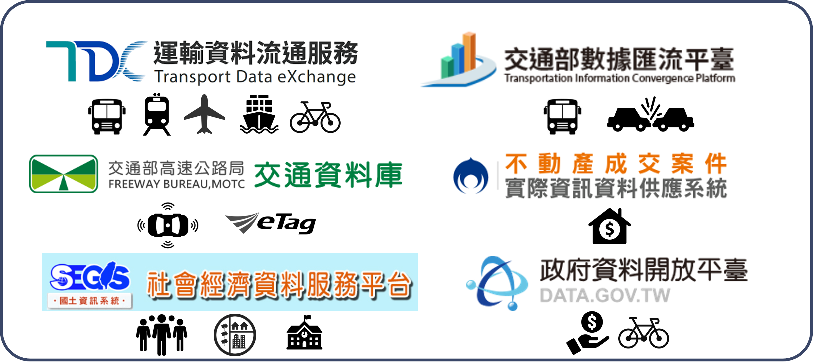

```{r setup, include=FALSE}
knitr::opts_chunk$set(echo = TRUE)
library(knitr)
library(kableExtra)
library(dplyr)
library(DT)
library(TDX)
```

# 運輸資料介接套件

## 套件功能
運輸資料涵蓋範圍廣泛，如公共運輸資料、交通流量資料、社會經濟資料等，皆儲存於不同的資料庫中，故本套件旨在整合各界資源，透過簡單的函式介接資料，以期提升運輸領域研究的資料蒐集效率。

## 常見運輸資料平臺
<span style="font-size:15pt;text-decoration:underline">**運輸資料流通服務平臺**</span>  
[運輸資料流通服務平臺（Transport Data eXchange, TDX）](https://tdx.transportdata.tw/)係透過 Open API 建立運輸領域開放資料服務，並將大部分運輸資料整合為一，以利使用者自單一介面尋找各類型運輸資料，其中包括公共運輸、路況資訊、停車資訊、觀光資訊、GIS 圖資、道路編碼、地理編碼等服務。其中公共運輸資料所涵蓋運具泛及軌道運輸（臺鐵、高鐵、捷運、輕軌）、公車（公路客運、市區公車）、公共自行車、航空、航運等。平臺上主要可分為動態資料與靜態資料，靜態資料係指更新週期較長的資料，如時刻表、線型等，而動態資料則是指短時間內定時更新的即時資料，諸如運具即時位置、即時運具剩餘數量等。本套件的大部分函式皆來自此一平臺，除可介接最新資料外，亦可下載特定歷史時間的資料。

<span style="font-size:15pt;text-decoration:underline">**交通部數據匯流平臺**</span>  
[交通部數據匯流平臺](https://ticp.motc.gov.tw/ConvergeProj/index)主要提供歷史運輸資料，惟此平臺下載資料的方式並非透過 Open Data 標準介面，而是直接自官網中申請資料，待平臺管理單位審核通過後即可下載。須注意的是，若欲申請此一平臺的資料必須先行註冊會員。故本套件無法直接介接該平臺的資料，請務必至網站申請與下載。此一平臺含括旅運資料、營運資料、安全資料等。旅運資料係指公共運輸站點、路線、歷史即時位置等，以及公路車輛偵測器、電子標籤（eTag）等資料，此資料現已轉移至 TDX 介接，並可透過本套件的函式取得該歷史資料。營運資料則是指公共運輸各站分時資料、電子票證資料、站點起訖對統計資料等。安全資料則為交通事故 A1、A2 的表一與表二資料。惟須注意，營運資料、安全資料除線上申請外，尚須撰寫書面申請資料摘要（如：研究計畫、應用程式開發計畫），以及書面申請使用表，並將兩份文件寄送至交通部數據匯流平臺予以審查。申請資料摘要範例請[點此](https://github.com/ChiaJung-Yeh/TDX_Guide/raw/master/documents/%E4%BA%A4%E9%80%9A%E9%83%A8%E4%BA%A4%E9%80%9A%E6%95%B8%E6%93%9A%E8%B3%87%E6%96%99%E7%94%B3%E8%AB%8B%E4%BD%BF%E7%94%A8%E8%A1%A8%E7%AF%84%E4%BE%8B.xlsx)；申請使用表範例請[點此](https://github.com/ChiaJung-Yeh/TDX_Guide/raw/master/documents/%E7%94%B3%E8%AB%8B%E8%B3%87%E6%96%99%E6%91%98%E8%A6%81%E7%AF%84%E4%BE%8B.docx)。

<span style="font-size:15pt;text-decoration:underline">**高公局交通資料庫**</span>  
[高公局交通資料庫](https://tisvcloud.freeway.gov.tw/)提供高速公路偵測器（VD）、電子收費系統（eTag）、路段線型圖資等資料，其中包括即時資料與歷史資料。其中eTag資料含括：各類車種通行量統計各類車種（M03A）、站間各車種中位數旅行時間（M04A）、站間各車種中位數行駛車速（M05A）、各旅次路徑原始資料（M06A）、各類車種旅次平均長度（M07A）和各類車種旅次數量（M08A）。此外，在介接或分析資料前，建議可參考[交通資料蒐集資源系統 資料使用手冊](https://tisvcloud.freeway.gov.tw/documents/TDCS%E4%BD%BF%E7%94%A8%E6%89%8B%E5%86%8Av34.pdf)與[即時路況資料標準](https://drive.google.com/file/d/12GzEhuiZa7yJc5zFGVEn8U9UJR22RrGy/view)，以利正確使用之。

<span style="font-size:15pt;text-decoration:underline">**社會經濟資料服務平臺**</span>  
[社會經濟資料服務平臺](https://segis.moi.gov.tw/STAT/Web/Portal/STAT_PortalHome.aspx)提供各層級行政區（縣市/鄉鎮市區/村里）的社經資料，涵蓋人口、勞動就業、土地營建、教育文化、醫療衛生、產業等社會各面向之資料。本套件中自該平臺介接人口與住宅普查資料、土地使用資料、全臺各級學校資料。

<span style="font-size:15pt;text-decoration:underline">**政府資料開放平臺**</span>  
[政府資料開放平臺](https://data.gov.tw/)涵蓋面向為所有資料庫中最廣者，泛及生育、婚姻、職業、投票、交通等。本套件於該平臺介接全臺村里所得資料、臺北市 YouBike 租借紀錄資料。

<span style="font-size:15pt;text-decoration:underline">**不動產成交案件資料供應系統**</span>  
[不動產成交案件資料供應系統](https://plvr.land.moi.gov.tw/DownloadOpenData)提供介接房價與土地交易價格資料之 API，資料含括不動產買賣、預售屋買賣與不動產租賃。

本套件所介接之資料庫平臺彙整如下圖：

```{r TDX_outline, echo=F, eval=T, out.width="60%", fig.align="center"}

```

本指南所開發之套件功能彙整如下表：

```{r TDX_table, echo=F, eval=T}
TDX_table=data.frame(data=c(rep("軌道", 7), rep("公車", 8), rep("自行車", 4), rep("航空與航運", 4), rep("高速公路", 2), "停車場","觀光點位", "道路路網", "地理編碼",rep("社經與土地", 7),"行政區","GTFS","事故資料"), type=c("軌道站點","軌道路線站點","軌道站點出口","軌道路線線型","軌道班表","軌道票價","軌道站間旅行時間","公車站點","公車路線","公車路線線型","公車班表","公車站間旅行時間","公車票價","公車車輛","公車動態","公共自行車站點","自行車路網","公共自行車站點歷史動態","臺北市公共自行車租借紀錄","航空班表","港口點位","航運航線","航線靠港順序","高快速公路線型","高速公路 etag 與 VD","停車場點位資訊","景點、餐廳、旅館點位","道路路網線型","地理編碼服務","人口（含各年齡層與性別資料）","土地使用","所得（各村里）","房價","學校","醫院","工商服務業","行政區疆域","公共運輸標準格式","全臺事故資料"), class=c(rep("點", 3),"線",rep("文字", 3),"點","文字","線",rep("文字", 4),"點","點","線",rep("文字", 3),"點",rep("文字", 2),"線","文字","點","點","線","點",rep("面", 2),rep("文字", 2),"點",rep("面", 3),"文字","點/文字"), functiona=c("`Rail_Station()`", "`Rail_StationOfLine()`","`Rail_StationExit()`", "`Rail_Shape()`", "`Rail_TimeTable()`", "`Rail_ODFare()`", "`Rail_TravelTime()`", "`Bus_StopOfRoute()`", "`Bus_Route()`", "`Bus_Shape()`", "`Bus_Schedule()`", "`Bus_TravelTime()`","`Bus_RouteFare()`","`Bus_Vehicle()`","`Bus_RealTime()`", "`Bike_Station()`", "`Bike_Shape()`", "`Bike_Remain_His()`", "`Bike_OD_His()`", "`Air_Schedule()`", "`Ship_Port()`", "`Ship_Route()`", "`Ship_StopOfRoute()`", "`Freeway_Shape()`","`Freeway_History()`","`Car_Park()`","`Tourism()`","`Road_Network()`","`Geocoding()`","`Population()`","`Landuse()`","`Income()`","`House_Price()`","`School()`","`Hospital()`","`Business()`","`District_Shape()`","`gtfs()`","`Crash()`"))

colnames(TDX_table)=c("資料","資料細目","資料型態","函式")
kable(TDX_table, booktabs=T, caption="本套件函式綜覽")%>%
  kable_styling(bootstrap_options=c("striped", "hover"), font_size=14)%>%
  column_spec(1, bold=T)%>%
  collapse_rows(columns=c(1:4))%>%
  row_spec(0, bold=T, color="white", background="#8E8E8E")
```


## 套件安裝說明

```{r TDX_icon, echo=F, eval=T, out.width="30%", fig.align="center"}
include_graphics("./figure/TDX_icon.png")
```

本指南中所建立的 TDX 套件可利用 R 語言或 Python 安裝之。

<span style="font-size:15pt;text-decoration:underline">**R**</span>
```{r TDX_install_R, echo=T, eval=F}
# 安裝devtools套件
install.packages(devtools)

# 自GitHub下載TDX套件
devtools::install_github("ChiaJung-Yeh/NYCU_TDX")

# 載入TDX套件
library(TDX)
```

<span style="font-size:15pt;text-decoration:underline">**Python**</span>
```{r TDX_install_py, echo=T, eval=F}
# 自PyPI下載TDX套件(使用Anaconda Prompt)
pip install nycu-tdx-py

# 載入TDX套件
from nycu_tdx_py import tdx
```


## 聯繫
葉家榮 (Chia-Jung Yeh)
Email: <a href="mailto:chia-jung.yeh@sydney.edu.au"><u>chia-jung.yeh@sydney.edu.au</u></a>

