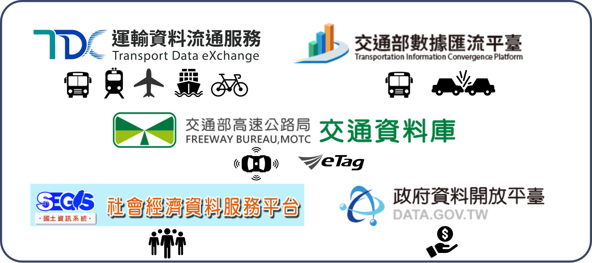

--- 
title: "R TDX 運輸資料介接"
author: "葉家榮\\\n 國立陽明交通大學 運輸與物流管理學系"
date: "`r Sys.Date()`"
site: bookdown::bookdown_site
# output: bookdown::gitbook
documentclass: book
bibliography: [book.bib, packages.bib]
biblio-style: apalike
link-citations: yes
github-repo: ChiaJung-Yeh/TDX_Guide
description: "運輸資料介接"
---

```{r setup, include=FALSE}
knitr::opts_chunk$set(echo = TRUE)
library(knitr)
library(kableExtra)
library(dplyr)
```

 
# **TDX 簡介**

「運輸資料流通服務平臺」（Transport Data eXchange, TDX）係透過 Open API 建立運輸領域開放資料服務，並將所有運輸資料平臺整合為一，以利使用者自單一介面尋找各類型運輸資料。平臺上主要可分為動態資料與靜態資料，靜態資料係指更新週期較長的資料，如時刻表、線型等，而動態資料則是指短時間內定時更新的即時資料，諸如運具即時位置、即時運具剩餘數量等。「運輸資料流通服務平臺」可細分為五個平臺，包括：公共運輸整合資訊流通服務平臺（PTX）、即時路況與停車資訊流通平臺、交通部數據匯流平臺、交通資訊基礎路段編碼系統、交通網路地理資訊倉儲系統（GIS-T），架構如下圖所示，以下分別簡介各平臺的主要用途。  

```{r TDX_outline, echo=FALSE, out.width="80%", fig.align="center"}

```


## 公共運輸整合資訊流通服務平臺
[公共運輸整合資訊流通服務平臺(Public Transport Data eXchange, PTX)](https://ptx.transportdata.tw/PTX)，乃建立標準化、跨運具之公共運輸旅運開放資料服務，以 Open Data 標準介面提供公共運輸旅運資料服務 API，其中涵蓋全國尺度之公路（公車、自行車）、軌道（高鐵、臺鐵、捷運）、航空及航運四大類公共運輸動靜態資料。  


## 即時路況與停車資訊流通平臺
[即時路況與停車資訊流通平臺](https://traffic.transportdata.tw/) 乃蒐集路側設施及停車場相關資料，並依資料標準轉化後以 Open Data 標準介面提供資料介接服務 API。即時路況資料服務供應範疇涵蓋全國尺度之車輛偵測器、閉路電視攝影監控、資訊可變標誌、自動車輛辨識、電子標籤（eTag）、發布路段等；路況動靜態資料含括：業管機關、設備編號、所在位置、所在道路資訊、所在基礎路段編碼、路況動態資訊、影像、旅行時間、壅塞程度、流量、佔有率等。停車資料則包含路邊停車、路外停車等關聯資料。  


## 交通部數據匯流平臺
[交通部數據匯流平臺](https://ticp.motc.gov.tw/ConvergeProj/index)主要提供歷史運輸資料，惟此平臺下載資料的方式並非透過 Open Data 標準介面，而是直接自官網中申請資料，待平臺管理單位審核通過後即可下載。須注意的是，若欲申請此一平臺的資料必須先行註冊會員。公共運輸整合資訊流通服務平臺（PTX）以及即時路況與停車資訊流通平臺大多提供最新或即時的資料（惟部分 API 可直接介接歷史資料），而交通部數據匯流平臺則是將蒐集的所有資料予以清洗後供使用者申請加值應用，故資料欄位可能略為不同。此一平臺含括旅運資料、營運資料、安全資料等。旅運資料係指公共運輸站點、路線、歷史即時位置等，以及公路車輛偵測器、電子標籤（eTag）等資料。營運資料則是指公共運輸各站分時資料、電子票證資料、站點起訖對統計資料等。安全資料則為交通事故 A1、A2 的表一與表二資料。另外須特別注意，旅運資料大多可直接線上申請下載，然而營運資料、安全資料則除線上申請外，尚須撰寫書面申請說明書（如：研究計畫、應用程式開發計畫），寄送至交通部數據匯流平臺予以審查。  


## 交通資訊基礎路段編碼查詢系統
[交通資訊基礎路段編碼查詢系統](https://link.motc.gov.tw/)乃將各路段線型予以編碼，並提供精確的地理資料，載明資訊所在的實際位置。「路段編碼」是交通資訊常用的位置參照表示法，同時也是交通地理資料庫中路段物件的索引，以因應未來多元資訊之蒐集、發布及交換之需求。此平臺主要以車輛行駛之重要路網為對象，含括國道、快速道路、省道、縣道及重要市區道路等。此平臺所提供的地理資料可與即時路況與停車資訊流通平臺中的路段編碼相對照，以合併路段車流資訊與幾何線型資料。  


## 交通網路地理資訊倉儲系統
[交通網路地理資訊倉儲系統（GIS-T）](https://gist.motc.gov.tw/gist_web/)提供圖資流通供應服務，包含實體資料下載、API 服務介接與圖臺展示等服務。本平臺所蒐集的資料含括公路、軌道、公車、空運、海運、自行車、停車等。除了運具路網外，本平臺亦提供地理編碼（Geocoding）服務，亦即將地址轉換為經緯度，亦可將經緯度匹配最接近的地址。  


## R 語言資料介接套件
為方便 TDX 資料之使用，透過 R 語言開發介接資料之套件，以期使用者能快速取得需要的運輸資料，並進行後續的加值應用與分析。本套件提供公共運輸基礎資料、地理編碼服務、路網地理資料服務等，並支援轉換地理資料的格式，且可直接透過函式之設定將檔案逕輸出至指定的資料夾，降低介接資料的繁瑣程序。  

若欲使用介接運輸資料的套件，請在 R 軟體中先行安裝與載入套件，程式碼撰寫如下：

```{r TDX_install, echo=T, eval=F}
# 安裝devtools套件
install.packages(devtools)

# 自GitHub下載TDX套件
devtools::install_github("ChiaJung-Yeh/NYCU_TDX")

# 載入TDX套件
library(TDX)
```

TDX 套件中提供介接公車（公路客運、市區客運）、軌道（臺鐵、高鐵、捷運、輕軌）、公共自行車、航空等運具的資料，資料類型含括站點、班表、路線線型。除了運具相關資料外，本套件亦提供介接觀光景點、道路路網等資料，與地理編碼服務。目前套件擁有的功能，及其所對應的函式綜整如下表。  

```{r TDX_table, echo=F, eval=T}
TDX_table=data.frame(data=c(rep("軌道", 4), rep("公車", 3), rep("自行車", 2), "航空", "觀光景點", "道路路網", "地理編碼"), type=c("軌道站點","軌道路線站點","軌道路線線型","軌道班表","公車站點","公車路線線型","公車班表","公共自行車站點","自行車路網","航空班表","觀光景點點位","道路路網線型","地理編碼服務"), class=c(rep("點", 2),"線","文字","點","線","文字","點","線","文字","點","線","點"), functiona=c("`Rail_Shape()`","`Rail_Station()`","`Rail_StationOfLine()`","`Rail_TimeTable()`","`Bus_StopOfRoute()`","`Bus_Shape()`","`Bus_Schedule()`","`Bike_Station()`","`Bike_Shape()`","`
Air_Schedule()`","`ScenicSpot()`","`Road_Network()`","`Geocoding()`"))

colnames(TDX_table)=c("資料","資料細目","資料型態","函式")

kable(TDX_table, booktabs=T)%>%
  kable_styling(bootstrap_options=c("striped", "hover"), font_size=14)%>%
  column_spec(1, bold=T)%>%
  collapse_rows(columns=c(1,3))

```


