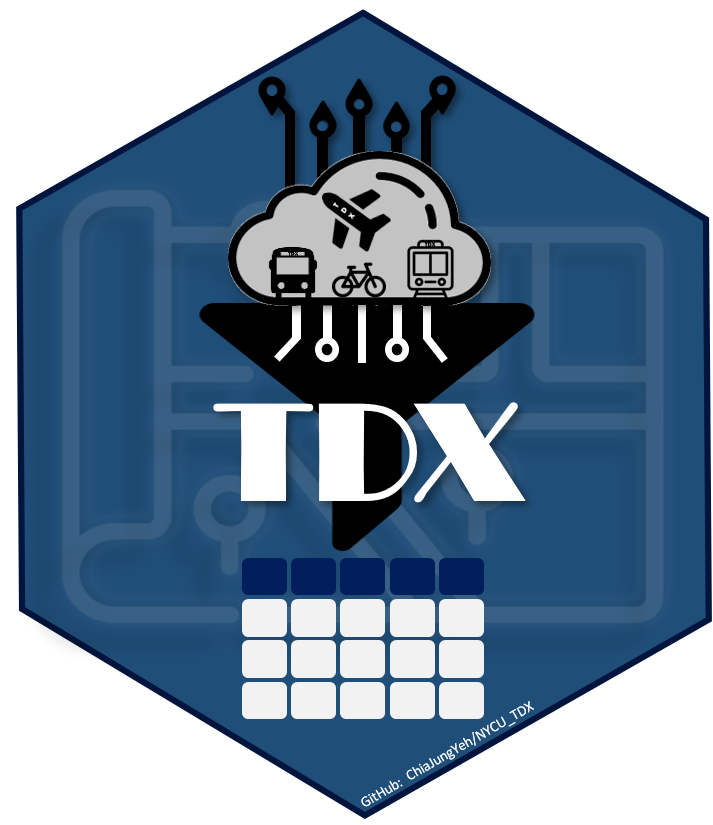

--- 
title: "R TDX 運輸資料介接指南"
author: "葉家榮\\\n 國立陽明交通大學 運輸與物流管理學系 (NYCU TLM)"
date: "`r Sys.Date()`"
site: bookdown::bookdown_site
output:
  bookdown::html_document2: default
  bookdown::pdf_document2: default
documentclass: book
bibliography: [book.bib, packages.bib]
biblio-style: apalike
link-citations: yes
github-repo: ChiaJung-Yeh/TDX_Guide
description: "運輸資料介接"
---


```{r setup, include=FALSE}
knitr::opts_chunk$set(echo = TRUE)
library(knitr)
library(kableExtra)
library(dplyr)
```


# **TDX 簡介**

[運輸資料流通服務平臺（Transport Data eXchange, TDX）](https://tdx.transportdata.tw/)係透過 Open API 建立運輸領域開放資料服務，並將所有運輸資料平臺整合為一，以利使用者自單一介面尋找各類型運輸資料。平臺上主要可分為動態資料與靜態資料，靜態資料係指更新週期較長的資料，如時刻表、線型等，而動態資料則是指短時間內定時更新的即時資料，諸如運具即時位置、即時運具剩餘數量等。「運輸資料流通服務平臺」可細分為五個平臺，包括：公共運輸整合資訊流通服務平臺（PTX）、即時路況與停車資訊流通平臺、交通部數據匯流平臺、交通資訊基礎路段編碼系統、交通網路地理資訊倉儲系統（GIS-T），架構如圖\@ref(fig:TDX-outline)所示，以下分別簡介各平臺的主要用途，惟請注意 TDX 平臺近期將逐漸整合各子平臺的服務，故子平臺可能會關閉，相同服務將轉移至 TDX。  

```{r TDX-outline, echo=F, out.width="80%", fig.align="center", fig.cap="TDX 平臺架構圖"}
include_graphics("./figure/TDX_outline.png")
```


## 公共運輸整合資訊流通服務平臺
[公共運輸整合資訊流通服務平臺(Public Transport Data eXchange, PTX)](https://ptx.transportdata.tw/PTX)，乃建立標準化、跨運具之公共運輸旅運開放資料服務，以 Open Data 標準介面提供公共運輸旅運資料服務 API，其中涵蓋全國尺度之公路（公車、自行車）、軌道（高鐵、臺鐵、捷運）、航空及航運四大類公共運輸動靜態資料。  

<span style="color: #CE0000;">_請注意 PTX 平臺將於 2022 年底關閉，舊有 API 不再提供服務，全數轉移至 TDX 平臺！_</span>  


## 即時路況與停車資訊流通平臺
[即時路況與停車資訊流通平臺](https://traffic.transportdata.tw/) 乃蒐集路側設施及停車場相關資料，並依資料標準轉化後以 Open Data 標準介面提供資料介接服務 API。即時路況資料服務供應範疇涵蓋全國尺度之車輛偵測器、閉路電視攝影監控、資訊可變標誌、自動車輛辨識、電子標籤（eTag）、發布路段等；路況動靜態資料含括：業管機關、設備編號、所在位置、所在道路資訊、所在基礎路段編碼、路況動態資訊、影像、旅行時間、壅塞程度、流量、佔有率等。停車資料則包含路邊停車、路外停車等關聯資料。  


## 交通部數據匯流平臺
[交通部數據匯流平臺](https://ticp.motc.gov.tw/ConvergeProj/index)主要提供歷史運輸資料，惟此平臺下載資料的方式並非透過 Open Data 標準介面，而是直接自官網中申請資料，待平臺管理單位審核通過後即可下載。須注意的是，若欲申請此一平臺的資料必須先行註冊會員。公共運輸整合資訊流通服務平臺（PTX）以及即時路況與停車資訊流通平臺大多提供最新或即時的資料（惟部分 API 可直接介接歷史資料），而交通部數據匯流平臺則是將蒐集的所有資料予以清洗後供使用者申請加值應用，故資料欄位可能略為不同。此一平臺含括旅運資料、營運資料、安全資料等。旅運資料係指公共運輸站點、路線、歷史即時位置等，以及公路車輛偵測器、電子標籤（eTag）等資料。營運資料則是指公共運輸各站分時資料、電子票證資料、站點起訖對統計資料等。安全資料則為交通事故 A1、A2 的表一與表二資料。另外須特別注意，旅運資料大多可直接線上申請下載，然而營運資料、安全資料則除線上申請外，尚須撰寫書面申請資料摘要（如：研究計畫、應用程式開發計畫），以及書面申請使用表，並將兩份文件寄送至交通部數據匯流平臺予以審查。申請資料摘要範例請[點此](https://github.com/ChiaJung-Yeh/TDX_Guide/raw/master/documents/%E4%BA%A4%E9%80%9A%E9%83%A8%E4%BA%A4%E9%80%9A%E6%95%B8%E6%93%9A%E8%B3%87%E6%96%99%E7%94%B3%E8%AB%8B%E4%BD%BF%E7%94%A8%E8%A1%A8%E7%AF%84%E4%BE%8B.xlsx)；申請使用表範例請[點此](https://github.com/ChiaJung-Yeh/TDX_Guide/raw/master/documents/%E7%94%B3%E8%AB%8B%E8%B3%87%E6%96%99%E6%91%98%E8%A6%81%E7%AF%84%E4%BE%8B.docx)。  


## 交通資訊基礎路段編碼查詢系統
[交通資訊基礎路段編碼查詢系統](https://link.motc.gov.tw/)乃將各路段線型予以編碼，並提供精確的地理資料，載明資訊所在的實際位置。「路段編碼」是交通資訊常用的位置參照表示法，同時也是交通地理資料庫中路段物件的索引，以因應未來多元資訊之蒐集、發布及交換之需求。此平臺主要以車輛行駛之重要路網為對象，含括國道、快速道路、省道、縣道及重要市區道路等。此平臺所提供的地理資料可與即時路況與停車資訊流通平臺中的路段編碼相對照，以合併路段車流資訊與幾何線型資料。  


## 交通網路地理資訊倉儲系統
[交通網路地理資訊倉儲系統（GIS-T）](https://gist.motc.gov.tw/gist_web/)提供圖資流通供應服務，包含實體資料下載、API 服務介接與圖臺展示等服務。本平臺所蒐集的資料含括公路、軌道、公車、空運、海運、自行車、停車等。除了運具路網外，本平臺亦提供地理編碼（Geocoding）服務，亦即將地址轉換為經緯度，亦可將經緯度匹配最接近的地址。  

<span style="color: #CE0000;">_請注意 GIS-T 平臺已關閉，舊有 API 不再提供服務，全數轉移至 TDX 平臺！_</span>  


## R 語言資料介接套件

```{r TDX_icon, echo=F, eval=T, out.width="30%", fig.align="center"}

```

:::notice
<font size="4">**NOTE**</font>  
本套件更新於2022-06-11，套件版本為2.2.1，請確保 TDX 套件為最新版本！
:::

### 套件下載
為方便 TDX 資料之使用，透過 R 語言開發介接資料之套件，以期使用者能快速取得需要的運輸資料，並進行後續的加值應用與分析。本套件提供公共運輸基礎資料、地理編碼服務、路網地理資料服務等，並支援轉換地理資料的格式，且可直接透過函式之設定將檔案逕輸出至指定的資料夾，降低介接資料的繁瑣程序。本套件的 API 服務全數介接自 TDX 平臺。  

若欲使用介接運輸資料的套件，請在 R 軟體中先行安裝與載入套件，程式碼撰寫如下：  

```{r TDX_install, echo=T, eval=F}
# 安裝devtools套件
install.packages(devtools)

# 自GitHub下載TDX套件
devtools::install_github("ChiaJung-Yeh/NYCU_TDX")

# 載入TDX套件
library(TDX)
```

TDX 套件中提供介接公車（公路客運、市區客運）、軌道（臺鐵、高鐵、捷運、輕軌）、公共自行車、航空、航運等運具的資料，資料類型含括站點、班表、路線線型。除了運具相關資料外，本套件亦可介接觀光點位、道路路網等資料，並提供地理編碼服務。目前套件擁有的功能，及其所對應的函式綜整如表\@ref(tab:TDX-table)。  

```{r TDX-table, echo=F, eval=T}
TDX_table=data.frame(data=c(rep("軌道", 5), rep("公車", 5), rep("自行車", 2), rep("航空與航運", 4), "觀光點位", "道路路網", "地理編碼"), type=c("軌道站點","軌道路線站點","軌道路線線型","軌道班表","軌道票價","公車站點","公車路線","公車路線線型","公車班表","公車站間旅行時間","公共自行車站點","自行車路網","航空班表","港口點位","航運航線","航線靠港順序","景點、餐廳、旅館點位","道路路網線型","地理編碼服務"), class=c(rep("點", 2),"線",rep("文字", 2),"點","文字","線","文字","文字","點","線","文字","點",rep("文字", 2),"點","線","點"), functiona=c("[`Rail_Station()`](#軌道站點資料)", "[`Rail_StationOfLine()`](#軌道路線站點資料)", "[`Rail_Shape()`](#軌道路線線型資料)", "[`Rail_TimeTable()`](#軌道班表資料)", "[`Rail_ODFare()`](#軌道票價資料)", "[`Bus_StopOfRoute()`](#公車路線站點資料)", "[`Bus_Route()`](#公車路線資料)", "[`Bus_Shape()`](#公車路線線型資料)", "[`Bus_Schedule()`](#公車班表資料)", "[`Bus_TravelTime()`](#公車站間旅行時間資料)", "[`Bike_Station()`](#公共自行車站點資料)", "[`Bike_Shape()`](#自行車線型資料)", "[`Air_Schedule()`](#航空班表資料)", "[`Ship_Port()`](#港口點位資料)", "[`Ship_Route()`](#航運航線資料)", "[`Ship_StopOfRoute()`](#航線靠港順序資料)", "[`Tourism()`](#觀光點位)","[`Road_Network()`](#道路路網線型)","[`Geocoding()`](#地理編碼服務)"))

colnames(TDX_table)=c("資料","資料細目","資料型態","函式")

kable(TDX_table, booktabs=T, caption="本套件函式綜覽")%>%
  kable_styling(bootstrap_options=c("striped", "hover"), font_size=14)%>%
  column_spec(1, bold=T)%>%
  collapse_rows(columns=c(1:4))%>%
  row_spec(0, bold=T, color="white", background="#8E8E8E")
```

### API 金鑰申請

在使用 TDX 套件前，必須先自[運輸資料流通服務平臺](https://tdx.transportdata.tw/register)申請會員，若為學生且具學生信箱帳號者，可申請「學研單位」的會員。會員申請頁面如圖\@ref(fig:TDX-member)所示。  

```{r TDX-member, echo=F, out.width="100%", fig.align="center", fig.cap="TDX 會員申請頁面"}
include_graphics("./figure/TDX_member.png")
```

經 TDX 平臺審查後，即會收到審核通過通知，登入會員後即獲取一組金鑰（Client Id & Client Secret），請查看 [API 金鑰](https://tdx.transportdata.tw/user/dataservice/key)頁面（點選網頁右上角會員中心 >> 資料服務 >> API 金鑰），如圖\@ref(fig:TDX-key)所示。接著點選綠色「編輯」鈕，以查看 Client Id 與 Client Secret，並保存之，如圖\@ref(fig:TDX-id-secret)所示。若欲申請其他 API 金鑰，可點選「新增 API 金鑰」即自動產生新的一組 API，惟每一會員最多僅能申請三個 API 金鑰。 

```{r TDX-key, echo=F, out.width="100%", fig.align="center", fig.cap="TDX API 金鑰頁面"}
include_graphics("./figure/TDX_key.png")
```

```{r TDX-id-secret, echo=F, out.width="60%", fig.align="center", fig.cap="TDX API Client Id 與 Client Secret"}
include_graphics("./figure/TDX_id_secret.png")
```


### Access Token 取得方式
在本套件中乃利用 Access Token （可以想成一個登入的序號）介接 API 服務，故每次下載資料時，皆必須輸入一組有效的 Access Token，可利用 TDX 套件中的`get_token()`函式獲取之。另請注意，Access Token 的期效為一天，故到期後該 Access Token 將自動失效，必須重新使用`get_token()`函式取得新的一組序號。`get_token()`函式的操作方法如下：  

```{r TDX_get_token, echo=T, eval=F}
# 輸入 Client Id 與 Client Secret 兩參數
get_token(client_id="YOUR-ID", client_secret="YOUR-SECRET")
```

此一函式中必須設定兩個參數，即自 TDX 平臺申請所得到的 Client Id 與 Client Secret，輸入完畢後即產生一組有效期限為一天的 Access Token，後續使用本套件的介接函式時，皆必須設定此序號。  


### 套件版本目錄
```{r TDX-version, echo=F, eval=T}
version_table=data.frame(version=c("1.0","1.1","1.2","1.2.1","1.2.2","1.3","1.3.1","2.0","2.1","2.2","2.2.1"),
                         date=c("2022-02-08","2022-02-10","2022-02-14","2022-02-28","2022-03-05","2022-03-12","2022-03-24","2022-05-30","2022-06-01","2022-06-02","2022-06-11"),
                     update=c("公車、軌道、自行車之公共運輸介接函式", "新增地理編碼服務", "新增航空班表、觀光景點、道路路網介接函式", "修正地理編碼函式錯誤（Unicode亂碼問題）", "修正地理編碼函式錯誤（HTTP ERROR問題）","新增公車路線介接函式","修正公車路線介接函式路線名稱錯誤","TDX 大改版，重新更正介接方式（存取 API 服務的 token）與各函式","新增公車站間旅行時間資料、航運相關資料","新增軌道票價資料、修正觀光點位資料（包含景點、餐廳、旅館）","優化地理編碼函式（進度條、無法編碼清單）"))

colnames(version_table)=c("套件版本","日期","新增/修正功能")

kable(version_table, booktabs=T, caption="套件版本目錄")%>%
  kable_styling(bootstrap_options=c("striped", "hover"), font_size=14)%>%
  column_spec(1, bold=T)%>%
  row_spec(0, bold=T, color="white", background="#8E8E8E")
```

第一代套件係介接各子平臺之服務，包括 PTX 與 GIS-T，若欲使用之，請先自 PTX 網站[申請 API](https://ptx.transportdata.tw/PTX/Management/AccountApply)，並[點此](https://github.com/ChiaJung-Yeh/NYCU_TDX/raw/main/old_version/NYCU_TDX_v1.zip)下載舊版套件。惟建議使用當前新版的套件即可，資料介接更豐富，且會持續更新！  


