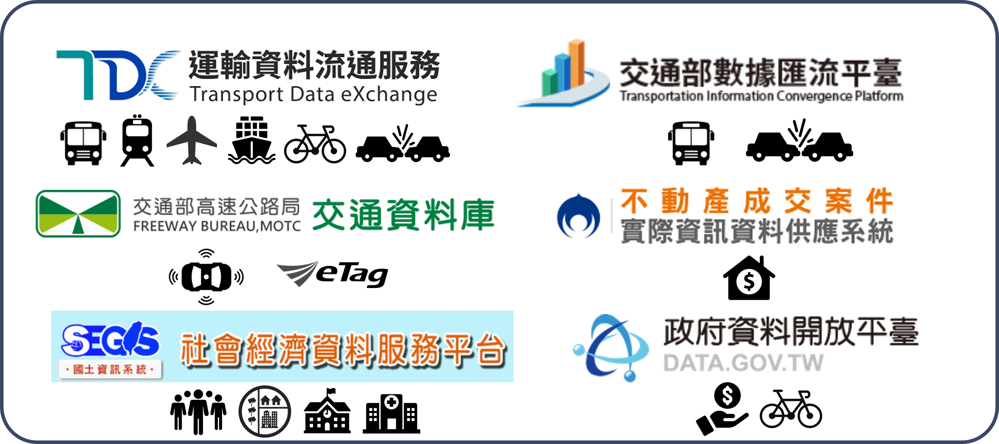

--- 
title: "TDX 運輸資料介接指南"
author: "Chia-Jung (Robert) Yeh  葉家榮\\\n [**PhD: Insitute of Transport and Logistics Studies, USYD**](https://www.sydney.edu.au/business/about/our-people/research-students/chia-jung-yeh-557.html)\\\nM.S.: Department of Transportation and Logistics Management, NYCU"
date: "`r Sys.Date()`"
site: bookdown::bookdown_site
output:
  bookdown::html_document2: default
  bookdown::pdf_document2: default
documentclass: book
bibliography: [book.bib, packages.bib]
biblio-style: apalike
link-citations: yes
github-repo: ChiaJung-Yeh/TDX_Guide
description: "運輸資料介接"
---

```{r setup, include=FALSE}
# devtools::install_github("kupietz/kableExtra")
knitr::opts_chunk$set(echo = TRUE)
library(knitr)
library(kableExtra)
library(dplyr)
library(TDX)
```


# **運輸資料與介接套件**
運輸資料涵蓋範圍廣泛，如公共運輸資料、交通流量資料、社會經濟資料等，皆儲存於不同的資料庫中，故本套件旨在整合各界資源，透過簡單的函式介接資料，以期提升運輸領域研究的資料蒐集效率。  

本網站內容另請參照[<地理資訊系統與空間運算：R軟體應用>(五南)](https://www.books.com.tw/products/0010979785)一書「CHAPTER 05 運輸資料介接與應用」。  


## 常見運輸資料平臺
<span style="font-size:15pt;text-decoration:underline">**運輸資料流通服務平臺**</span>  
[運輸資料流通服務平臺（Transport Data eXchange, TDX）](https://tdx.transportdata.tw/)係透過 Open API 建立運輸領域開放資料服務，並將大部分運輸資料整合為一，以利使用者自單一介面尋找各類型運輸資料，其中包括公共運輸、路況資訊、停車資訊、觀光資訊、GIS 圖資、道路編碼、地理編碼、事故資料等服務。其中公共運輸資料所涵蓋運具泛及軌道運輸（臺鐵、高鐵、捷運、輕軌）、公車（公路客運、市區公車）、公共自行車、航空、航運等。平臺上主要可分為動態資料與靜態資料，靜態資料係指更新週期較長的資料，如時刻表、線型等，而動態資料則是指短時間內定時更新的即時資料，諸如運具即時位置、即時運具剩餘數量等。本套件的大部分函式皆來自此一平臺，除可介接最新資料外，亦可下載特定歷史時間的資料。

<span style="font-size:15pt;text-decoration:underline">**交通部數據匯流平臺**</span>  
[交通部數據匯流平臺](https://ticp.motc.gov.tw/ConvergeProj/index)主要提供歷史運輸資料，惟此平臺下載資料的方式並非透過 Open Data 標準介面，而是直接自官網中申請資料，待平臺管理單位審核通過後即可下載。須注意的是，若欲申請此一平臺的資料必須先行註冊會員。故本套件無法直接介接該平臺的資料，請務必至網站申請與下載。此一平臺含括旅運資料、營運資料、安全資料等。旅運資料係指公共運輸站點、路線、歷史即時位置等，以及公路車輛偵測器、電子標籤（eTag）等資料，此資料現已轉移至 TDX 介接，並可透過本套件的函式取得該歷史資料。營運資料則是指公共運輸各站分時資料、電子票證資料、站點起訖對統計資料等。安全資料則為交通事故 A1、A2 的表一與表二資料，現亦可逕於 TDX 介接。惟須注意，營運資料、安全資料除線上申請外，尚須撰寫書面申請資料摘要（如：研究計畫、應用程式開發計畫），以及書面申請使用表，並將兩份文件寄送至交通部數據匯流平臺予以審查。申請資料摘要範例請[點此](https://github.com/ChiaJung-Yeh/TDX_Guide/raw/master/documents/%E4%BA%A4%E9%80%9A%E9%83%A8%E4%BA%A4%E9%80%9A%E6%95%B8%E6%93%9A%E8%B3%87%E6%96%99%E7%94%B3%E8%AB%8B%E4%BD%BF%E7%94%A8%E8%A1%A8%E7%AF%84%E4%BE%8B.xlsx)；申請使用表範例請[點此](https://github.com/ChiaJung-Yeh/TDX_Guide/raw/master/documents/%E7%94%B3%E8%AB%8B%E8%B3%87%E6%96%99%E6%91%98%E8%A6%81%E7%AF%84%E4%BE%8B.docx)。

<span style="font-size:15pt;text-decoration:underline">**高公局交通資料庫**</span>  
[高公局交通資料庫](https://tisvcloud.freeway.gov.tw/)提供高速公路偵測器（VD）、電子收費系統（eTag）、路段線型圖資等資料，其中包括即時資料與歷史資料。其中eTag資料含括：各類車種通行量統計各類車種（M03A）、站間各車種中位數旅行時間（M04A）、站間各車種中位數行駛車速（M05A）、各旅次路徑原始資料（M06A）、各類車種旅次平均長度（M07A）和各類車種旅次數量（M08A）。此外，在介接或分析資料前，建議可參考[交通資料蒐集資源系統 資料使用手冊](https://tisvcloud.freeway.gov.tw/documents/TDCS%E4%BD%BF%E7%94%A8%E6%89%8B%E5%86%8Av34.pdf)與[即時路況資料標準](https://drive.google.com/file/d/12GzEhuiZa7yJc5zFGVEn8U9UJR22RrGy/view)，以利正確使用之。

<span style="font-size:15pt;text-decoration:underline">**社會經濟資料服務平臺**</span>  
[社會經濟資料服務平臺](https://segis.moi.gov.tw/STAT/Web/Portal/STAT_PortalHome.aspx)提供各層級行政區（縣市/鄉鎮市區/村里）的社經資料，涵蓋人口、勞動就業、土地營建、教育文化、醫療衛生、產業等社會各面向之資料。本套件中自該平臺介接人口與住宅普查資料、土地使用資料、全臺各級學校資料、醫療院所統計資料、工商服務業統計資料。

<span style="font-size:15pt;text-decoration:underline">**政府資料開放平臺**</span>  
[政府資料開放平臺](https://data.gov.tw/)涵蓋面向為所有資料庫中最廣者，泛及生育、婚姻、職業、投票、交通等。本套件於該平臺介接全臺村里所得資料、臺北市 YouBike 租借紀錄資料。

<span style="font-size:15pt;text-decoration:underline">**不動產成交案件資料供應系統**</span>  
[不動產成交案件資料供應系統](https://plvr.land.moi.gov.tw/DownloadOpenData)提供介接房價與土地交易價格資料之 API，資料含括不動產買賣、預售屋買賣與不動產租賃。

<br></br>
綜上各資料庫平臺之簡介，本套件所使用的介接平臺與資料如圖\@ref(fig:TDX-outline)所示。

```{r TDX-outline, echo=F, out.width="80%", fig.align="center", fig.cap="TDX 平臺架構圖"}

```


## 資料介接套件

```{r TDX_icon, echo=F, eval=T, out.width="30%", fig.align="center"}
include_graphics("./figure/TDX_icon.png")
```

:::notice
<font size="4">**NOTE**</font>  
請確保 TDX 套件為最新版本！<br>
R 套件更新於 2024-01-22，套件版本為 3.8.1<br>
Python 套件更新於 2023-10-17，套件版本為 0.1.52 (註：Python 套件仍在努力更新中...)
:::

### 套件下載
為方便 TDX 資料之使用，透過 R 與 Python 開發介接資料之套件，以期使用者能快速取得需要的運輸資料，並進行後續的加值應用與分析。本套件提供公共運輸基礎資料、地理編碼服務、路網地理資料服務等，並支援轉換地理資料的格式，且可直接透過函式之設定將檔案逕輸出至指定的資料夾，降低介接資料的繁瑣程序。  

若欲使用介接運輸資料的套件，請在程式中先行安裝與載入套件，程式碼撰寫如下：

<span style="font-size:15pt;text-decoration:underline">**R**</span>
```{r TDX_install_R, echo=T, eval=F}
# 安裝devtools套件
install.packages(devtools)

# 自GitHub下載TDX套件
devtools::install_github("ChiaJung-Yeh/NYCU_TDX")

# 載入TDX套件
library(TDX)
```

<span style="font-size:15pt;text-decoration:underline">**Python**</span>
```{r TDX_install_py, echo=T, eval=F}
# 自PyPI下載TDX套件(使用Anaconda Prompt)
pip install nycu-tdx-py

# 載入TDX套件
from nycu_tdx_py import tdx
```

由於目前 R 套件開發較為完整，範例說明將皆以 R 示範。TDX 套件中提供介接公車（公路客運、市區客運）、軌道（臺鐵、高鐵、捷運、輕軌）、公共自行車、航空、航運等運具的資料，資料類型含括站點、班表、路線線型。除運具相關資料外，本套件亦可介接觀光點位、道路路網等資料、地理編碼服務、人口與所得資料等。目前套件擁有的功能，及其所對應的函式綜整如表\@ref(tab:TDX-table)。  

```{r TDX-table, echo=F, eval=T}
TDX_table=data.frame(data=c(rep("軌道", 7), rep("公車", 10), rep("自行車", 4), rep("航空與航運", 4), rep("高速公路", 2), "停車場","觀光點位", "道路路網", "地理編碼",rep("社經與土地", 7),"行政區","GTFS","事故資料"), type=c("軌道站點","軌道路線站點","軌道站點出口","軌道路線線型","軌道班表","軌道票價","軌道站間旅行時間","公車站點","公車路線","公車路線線型","公車班表","公車站站班表","公車站間旅行時間","公車站間旅行距離","公車票價","公車車輛","公車動態","公共自行車站點","自行車路網","公共自行車站點歷史動態","臺北市公共自行車租借紀錄","航空班表","港口點位","航運航線","航線靠港順序","高快速公路線型","高速公路 etag 與 VD","停車場點位資訊","景點、餐廳、旅館點位","道路路網線型","地理編碼服務","人口（含各年齡層與性別資料）","土地使用","所得（各村里）","房價","學校","醫院","工商服務業","行政區疆域","公共運輸標準格式","全臺事故資料"), class=c(rep("點", 3),"線",rep("文字", 3),"點","文字","線",rep("文字", 6),"點","點","線",rep("文字", 3),"點",rep("文字", 2),"線","文字","點","點","線","點",rep("面", 2),rep("文字", 2),"點",rep("面", 3),"文字","點/文字"), functiona=c("[`Rail_Station()`](#軌道站點資料)", "[`Rail_StationOfLine()`](#軌道路線站點資料)","[`Rail_StationExit()`](#軌道站點出口資料)", "[`Rail_Shape()`](#軌道路線線型資料)", "[`Rail_TimeTable()`](#軌道班表資料)", "[`Rail_ODFare()`](#軌道票價資料)", "[`Rail_TravelTime()`](#軌道站間旅行時間資料)", "[`Bus_StopOfRoute()`](#公車站點資料)", "[`Bus_Route()`](#公車路線資料)", "[`Bus_Shape()`](#公車路線線型資料)", "[`Bus_Schedule()`](#公車班表資料)","[`Bus_ScheduleEst()`](#公車站站班表資料)", "[`Bus_TravelTime()`](#公車站間旅行時間資料)","[`Bus_Distance()`](#公車站間旅行距離資料)","[`Bus_RouteFare()`](#公車票價資料)","[`Bus_Vehicle()`](#公車車輛資料)","[`Bus_RealTime()`](#公車動態資料)", "[`Bike_Station()`](#公共自行車站點資料)", "[`Bike_Shape()`](#自行車線型資料)", "[`Bike_Remain_His()`](#公共自行車站點歷史動態資料)", "[`Bike_OD_His()`](#公共自行車租借紀錄資料)", "[`Air_Schedule()`](#航空班表資料)", "[`Ship_Port()`](#港口點位資料)", "[`Ship_Route()`](#航運航線資料)", "[`Ship_StopOfRoute()`](#航線靠港順序資料)", "[`Freeway_Shape()`](#高快速公路線型資料)","[`Freeway_History()`](#高速公路etag與VD資料)","[`Car_Park()`](#停車場點位資料)", "[`Tourism()`](#觀光點位資料)","[`Road_Network()`](#道路路網線型資料)","[`Geocoding()`](#地理編碼服務)","[`Population()`](#人口資料)","[`Landuse()`](#土地使用資料)","[`Income()`](#所得資料)","[`House_Price()`](#房價資料)","[`School()`](#學校資料)","[`Hospital()`](#醫院資料)","[`Business()`](#工商服務業資料)","[`District_Shape()`](#行政區資料)","[`gtfs()`](#公共運輸標準資料)","[`Crash()`](#事故資料)"))

colnames(TDX_table)=c("資料","資料細目","資料型態","函式")
kable(TDX_table, booktabs=T, caption="本套件函式綜覽")%>%
  kable_styling(bootstrap_options=c("striped", "hover"), font_size=14)%>%
  column_spec(1, bold=T)%>%
  collapse_rows(columns=c(1:4))%>%
  row_spec(0, bold=T, color="white", background="#8E8E8E")
```

### API 金鑰申請

在使用 TDX 套件前，必須先自[運輸資料流通服務平臺](https://tdx.transportdata.tw/register)申請會員，若為學生且具學生信箱帳號者，可申請「學研單位」的會員。會員申請頁面如圖\@ref(fig:TDX-member)所示。  

```{r TDX-member, echo=F, out.width="100%", fig.align="center", fig.cap="TDX 會員申請頁面"}

```

經 TDX 平臺審查後，即會收到審核通過通知，登入會員後即獲取一組金鑰（Client Id & Client Secret），請查看 [API 金鑰](https://tdx.transportdata.tw/user/dataservice/key)頁面（點選網頁右上角會員中心 >> 資料服務 >> API 金鑰），如圖\@ref(fig:TDX-key)所示。接著點選綠色「編輯」鈕，以查看 Client Id 與 Client Secret，並保存之，如圖\@ref(fig:TDX-id-secret)所示。若欲申請其他 API 金鑰，可點選「新增 API 金鑰」即自動產生新的一組 API，惟每一會員最多僅能申請三個 API 金鑰。 

```{r TDX-key, echo=F, out.width="100%", fig.align="center", fig.cap="TDX API 金鑰頁面"}
include_graphics("./figure/TDX_key.png")
```

```{r TDX-id-secret, echo=F, out.width="60%", fig.align="center", fig.cap="TDX API Client Id 與 Client Secret"}

```


### Access Token 取得方式
在本套件中乃利用 Access Token （可以想成一個登入的序號）介接 API 服務，故每次下載資料時，皆必須輸入一組有效的 Access Token，可利用 TDX 套件中的`get_token()`函式獲取之。另請注意，Access Token 的期效為一天，故到期後該 Access Token 將自動失效，必須重新使用`get_token()`函式取得新的一組序號。`get_token()`函式的操作方法如下：  

```{r TDX_get_token, echo=T, eval=F}
# 輸入 Client Id 與 Client Secret 兩參數
get_token(client_id="YOUR-ID", client_secret="YOUR-SECRET")
```

此一函式中必須設定兩個參數，即自 TDX 平臺申請所得到的 Client Id 與 Client Secret，輸入完畢後即產生一組有效期限為一天的 Access Token，後續使用本套件的介接函式時，皆必須設定此序號。

### 套件函式功能查詢
```{r TDX_function_find, echo=T, eval=F}
# 查詢公車費率函式
?Bus_RouteFare
```
[**查詢結果**](https://chiajung-yeh.github.io/TDX_Guide/Bus_RouteFare.html)

執行以上程式碼後，於 RStudio 右下角介面 Help 對話窗自動跳出函式資訊，並可透過「Run examples」執行範例程式碼。另外亦可點[此](https://rdrr.io/github/ChiaJung-Yeh/NYCU_TDX/)查詢本套件所有函式及其功能。


### R 套件版本目錄
```{r TDX-version, echo=F, eval=T}
version_table=data.frame(version=c("1.0","1.1","1.2","1.2.1","1.2.2","1.3","1.3.1","2.0","2.1","2.2","2.2.1","2.3","2.4","3.0","3.1","3.2","3.3","3.4","3.4.1","3.5","3.6","3.7","3.8","3.8.1","3.9"),
                         date=c("2022-02-08","2022-02-10","2022-02-14","2022-02-28","2022-03-05","2022-03-12","2022-03-24","2022-05-30","2022-06-01","2022-06-02","2022-06-11","2022-10-28","2022-10-30","2023-07-22","2023-08-14","2023-08-19","2023-08-24","2023-09-07","2023-09-15","2023-09-17","2023-09-30","2023-10-01","2023-12-01","2024-01-22","2024-07-10"),
                     update=c("公車、軌道、自行車之公共運輸介接函式", "新增地理編碼服務", "新增航空班表、觀光景點、道路路網介接函式", "修正地理編碼函式錯誤（Unicode 亂碼問題）", "修正地理編碼函式錯誤（HTTP ERROR問題）","新增公車路線介接函式","修正公車路線介接函式路線名稱錯誤","TDX 大改版，重新更正介接方式（存取 API 服務的 token）與各函式","新增公車站間旅行時間資料、航運相關資料","新增軌道票價資料、修正觀光點位資料（包含景點、餐廳、旅館）","優化地理編碼函式（進度條、無法編碼清單）","新增公共自行車剩餘車輛歷史資料介接函式","新增高快速公路線型線型、路邊停車資料介接函式","將所有函式更改為以 JSON 格式介接，以提升效率","公共運輸函式中新增查詢歷史資料功能","新增所得資料介接函式","新增 GTFS 格式函式","新增臺北市公共自行車租借紀錄函式","修正人口資料函式（介接統計區人口資料、新增介接圖資格式）","新增土地使用、學校資料介接函式","新增醫院、工商服務業統計資料介接函式","新增事故資料介接函式","新增公車站間距離與站站班表介接函式","修正公車站間距離函式","社會經濟資料服務平臺大更新，重新撰寫介接人口資料與圖資 API"))

colnames(version_table)=c("套件版本","日期","新增/修正功能")

kable(version_table, booktabs=T, caption="套件版本目錄")%>%
  kable_styling(bootstrap_options=c("striped", "hover"), font_size=14)%>%
  column_spec(1, bold=T)%>%
  row_spec(0, bold=T, color="white", background="#8E8E8E")
```


